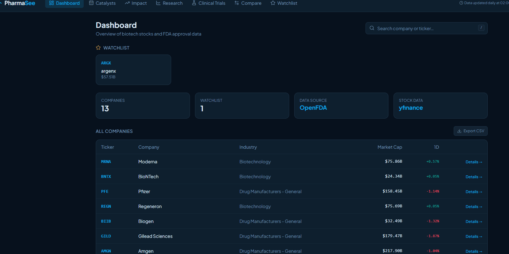
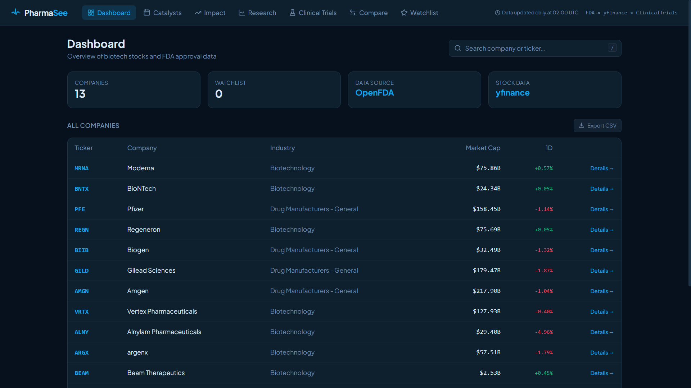
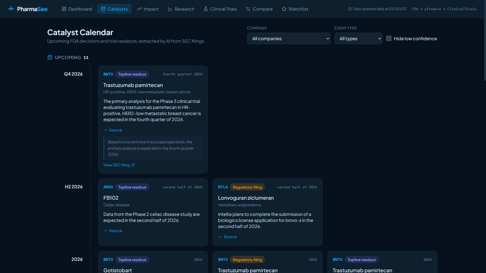
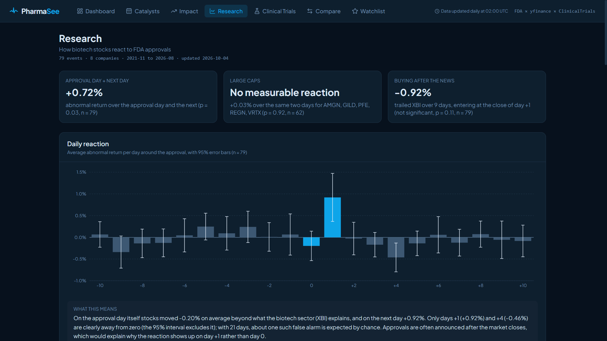
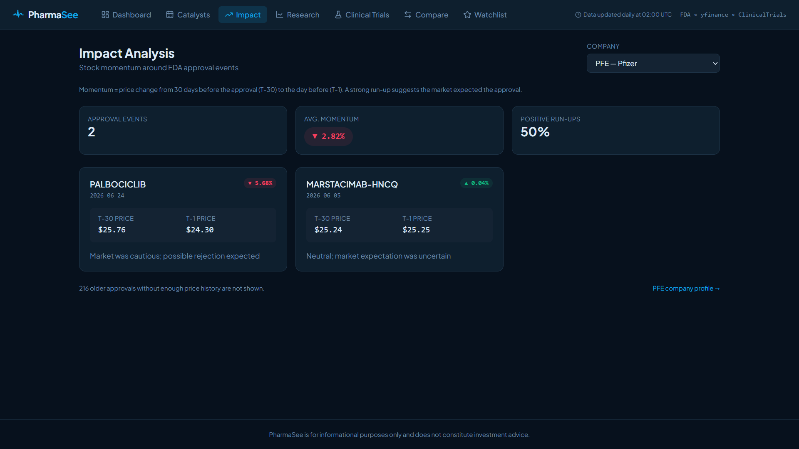
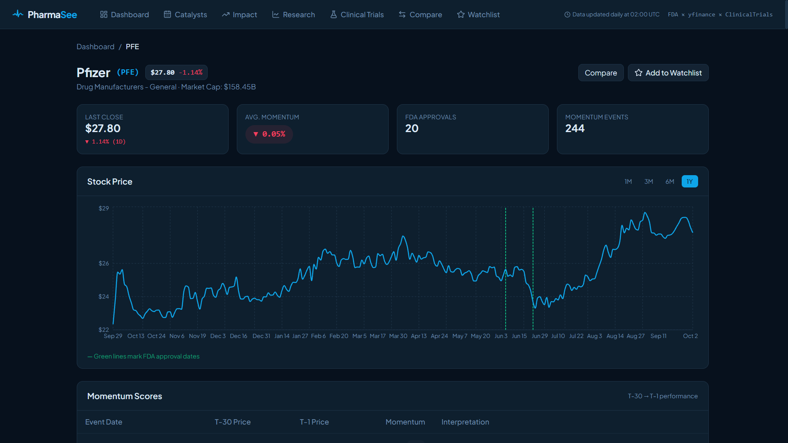

[](https://github.com/zehranuracikgoz/pharmaSee/actions/workflows/ci.yml)

**Language:** [🇬🇧 English](#english) · [🇹🇷 Türkçe](#türkçe)

**Live demo:** [pharma-see.vercel.app](https://pharma-see.vercel.app)

---

<a name="english"></a>

# PharmaSee — Pharma & Biotech Intelligence Platform

PharmaSee is a full-stack platform for tracking publicly traded pharmaceutical and biotech companies. It pulls stock data via yfinance, syncs FDA approval history, extracts upcoming catalysts from SEC filings, and provides momentum analysis, multi-ticker comparison tools and an event study of how stocks react to FDA approvals. Built with a FastAPI backend and a Next.js frontend deployed on Vercel and Render.



---

## Technologies

- **Python 3.11, FastAPI, SQLAlchemy (async), Alembic, SQLite (development) / PostgreSQL on Supabase (production)**
- **yfinance** — daily price history and market caps
- **OpenFDA (drugsfda) and ClinicalTrials.gov** — approval history and clinical trials
- **SEC EDGAR and Google Gemini** — filings and catalyst extraction
- **Next.js 14, TypeScript, Tailwind CSS**
- **Recharts** — stock price and research charts
- **APScheduler** — daily data refresh at 02:00 UTC
- **scipy, matplotlib** — event study and backtest (analysis scripts only)
- **pytest, pytest-asyncio, httpx**
- **GitHub Actions** — CI/CD
- **Docker, Vercel, Render, Supabase**

---

## Features

- Stock info and price history for pharma/biotech tickers, with market cap, industry, 1-day change and CSV export
- Tracked company database with search and FDA approval history
- Catalyst calendar — upcoming PDUFA dates, readouts and regulatory events extracted from SEC filings, each linked to its source
- Momentum analysis around drug approval events
- Research page — event study of stock reactions to FDA approvals and a sell-the-news backtest
- Clinical trials from ClinicalTrials.gov with phase breakdown
- Multi-ticker comparison with overlaid price charts
- Watchlist for tracking selected companies
- 24h server-side cache to reduce API load
- Full async backend with SQLite in development and PostgreSQL in production

---

## The Process

The project started with an FDA sync endpoint that populates a database with pharma company tickers. Stock data is fetched on demand via yfinance and cached for 24 hours. The momentum endpoint calculates price change around a given event date, enabling analysis of how FDA decisions affect stock performance. The frontend uses a dark theme — clean and institutional — built with Tailwind and Recharts. A daily job at 02:00 UTC refreshes approvals, market caps and SEC filings. CI runs backend tests and a Next.js production build in parallel on every push.

Catalyst calendar: new 8-K and 6-K press-release filings of the tracked companies are downloaded from SEC EDGAR, and Gemini extracts dated events (PDUFA dates, readouts, submissions, approvals) from the filing text. Every result is checked in code: the supporting quote must appear verbatim in the filing, planned or expected approvals are not stored as approvals, and relative dates such as "today" are replaced by the filing date. Each card on the Catalysts page links back to the SEC filing. Cross-model voting (several models read each filing and their agreement becomes a confidence badge) is built, but it currently runs with a single model, so no badge is shown.

Research: an event study measures how 79 FDA approvals (8 companies, November 2021 to August 2026) moved stocks relative to the XBI biotech ETF. The average stock gained 0.72% beyond the sector over the approval day and the next (p = 0.03), driven by the day after, while the five large caps showed no measurable reaction (+0.03%, p = 0.92). A sell-the-news backtest found no sign that a pre-approval run-up predicts a worse reaction (slope +0.01, R² = 0.000, p = 0.90), and buying after the news trailed XBI by 0.92% over 9 days, which is not significant (p = 0.11). The results and charts are on the [Research page](https://pharma-see.vercel.app/research); the sample is small, so treat them as descriptive.

---

## Installation

```bash
# Backend
cd backend
pip install -r requirements.txt
# .env (copy .env.example): DATABASE_URL, DEBUG, ALLOWED_ORIGINS, ADMIN_TOKEN, SEC_CONTACT_EMAIL, GEMINI_API_KEY

python -m alembic upgrade head
python -m uvicorn app.main:app --reload
```

```bash
# Frontend
cd frontend
npm install
# .env.local: NEXT_PUBLIC_API_URL

npm run dev
```

The app starts with the defaults (a local SQLite file); the catalyst extraction needs `SEC_CONTACT_EMAIL` and `GEMINI_API_KEY`, and the admin endpoints need `ADMIN_TOKEN`. The sync and extraction endpoints (`POST /fda/sync`, `/sec/sync`, `/sec/extract`, `/sec/reextract`) are admin-only: send the value of `ADMIN_TOKEN` in an `X-Admin-Token` header. They return 503 until `ADMIN_TOKEN` is set.

### Tests

```bash
cd backend
pip install -r requirements-analysis.txt  # the tests also cover the analysis scripts
python -m pytest tests/ -v
```

### Analysis scripts

```bash
cd backend
pip install -r requirements-analysis.txt  # adds scipy and matplotlib; production installs requirements.txt only
python -m analysis.event_study --source openfda
python -m analysis.sell_the_news --source openfda
python -m analysis.export_research --source openfda  # writes frontend/public/data/research.json
```

Results and charts are written to `backend/analysis/results/`.

---

## Limitations

- The backend runs on Render's free tier and sleeps when idle, so the first request can take up to 60 seconds (the site shows a notice).
- OpenFDA's drugsfda data has no CBER products (vaccines, gene therapies), so MRNA, BNTX and CRSP have no approval events in the research; BEAM and NTLA have no approved products yet.
- The research sample is small (79 events, 8 companies), most results are not statistically significant, and events from one company are not independent.
- Industry comes from a static mapping in `config.py` (checked with yfinance on 2026-10-04), because yfinance `.info` is blocked on Render.
- Catalysts are extracted by an AI model within free-tier rate limits; check the linked filing before relying on one.

---

## Screenshots

| | |
|---|---|
|  |  |
|  |  |
|  | |

---

<a name="türkçe"></a>

# PharmaSee — Farma ve Biyoteknoloji İstihbarat Platformu

PharmaSee, halka açık ilaç ve biyoteknoloji şirketlerini takip etmek için geliştirilmiş bir platformdur. yfinance üzerinden hisse verisi çeker, FDA onay geçmişini senkronize eder, SEC dosyalarından yaklaşan katalizörleri çıkarır; momentum analizi, çoklu ticker karşılaştırma araçları ve hisselerin FDA onaylarına nasıl tepki verdiğini ölçen bir olay çalışması sunar. FastAPI backend ve Next.js frontend'den oluşur; Vercel ve Render üzerinde yayındadır.


---

## Teknolojiler

- **Python 3.11, FastAPI, SQLAlchemy (async), Alembic, SQLite (geliştirme) / Supabase üzerinde PostgreSQL (üretim)**
- **yfinance** — günlük fiyat geçmişi ve piyasa değeri
- **OpenFDA (drugsfda) ve ClinicalTrials.gov** — onay geçmişi ve klinik çalışmalar
- **SEC EDGAR ve Google Gemini** — dosyalar ve katalizör çıkarımı
- **Next.js 14, TypeScript, Tailwind CSS**
- **Recharts** — hisse fiyat ve araştırma grafikleri
- **APScheduler** — her gün 02:00 UTC'de veri yenileme
- **scipy, matplotlib** — olay çalışması ve backtest (yalnızca analiz betikleri)
- **pytest, pytest-asyncio, httpx**
- **GitHub Actions** — CI/CD
- **Docker, Vercel, Render, Supabase**

---

## Özellikler

- Farma/biyoteknoloji tickerları için hisse bilgisi ve fiyat geçmişi; piyasa değeri, alt sektör (industry), 1 günlük değişim ve CSV dışa aktarma
- Takip edilen şirketlerin veritabanı, arama ve FDA onay geçmişi
- Katalizör takvimi — SEC dosyalarından çıkarılan yaklaşan PDUFA tarihleri, veri açıklamaları ve düzenleyici olaylar; her biri kaynağına bağlı
- İlaç onay olayları etrafında momentum analizi
- Araştırma sayfası — hisselerin FDA onaylarına tepkisini ölçen olay çalışması ve "haberi sat" backtest'i
- ClinicalTrials.gov'dan klinik çalışmalar ve faz dağılımı
- Üst üste bindirilmiş fiyat grafikleriyle çoklu ticker karşılaştırması
- Seçili şirketleri takip etmek için izleme listesi
- API yükünü azaltmak için 24 saatlik sunucu taraflı önbellekleme
- Geliştirmede SQLite, üretimde PostgreSQL ile tam async backend

---

## Süreç

Proje, bir veritabanını farma şirketi tickerlarıyla dolduran bir FDA senkronizasyon endpoint'iyle başladı. Hisse verileri yfinance aracılığıyla talep üzerine çekilir ve 24 saat önbelleklenir. Momentum endpoint'i, belirli bir olay tarihi etrafındaki fiyat değişimini hesaplar; bu sayede FDA kararlarının hisse performansına etkisi analiz edilebilir. Frontend, Tailwind ve Recharts ile oluşturulmuş kurumsal bir görünüm sunan koyu temayı kullanır. Her gün 02:00 UTC'de çalışan bir görev onayları, piyasa değerlerini ve SEC dosyalarını yeniler. CI, her push'ta backend testlerini ve Next.js production build'ini paralel olarak çalıştırır.

Katalizör takvimi: takip edilen şirketlerin yeni 8-K ve 6-K basın bülteni dosyaları SEC EDGAR'dan indirilir ve Gemini dosya metninden tarihli olayları (PDUFA tarihleri, veri açıklamaları, başvurular, onaylar) çıkarır. Her sonuç kodda kontrol edilir: destekleyen alıntı dosyada birebir geçmelidir, planlanan veya beklenen onaylar onay olarak kaydedilmez ve "bugün" gibi göreli tarihler dosya tarihiyle değiştirilir. Katalizörler sayfasındaki her kart SEC dosyasına bağlanır. Modeller arası oylama (birkaç model her dosyayı okur, uyumları bir güven rozetine dönüşür) hazırdır, ancak şu an tek model ile çalışır; bu yüzden rozet gösterilmez.

Araştırma: bir olay çalışması, 79 FDA onayının (8 şirket, Kasım 2021 – Ağustos 2026) hisseleri XBI biyoteknoloji ETF'ine göre nasıl hareket ettirdiğini ölçer. Ortalama hisse, onay günü ve ertesi gün boyunca sektörün %0,72 üzerinde getiri sağladı (p = 0,03); bu hareket ertesi günden geliyor, beş büyük şirket ise ölçülebilir bir tepki göstermedi (+%0,03, p = 0,92). "Haberi sat" backtest'i, onay öncesi yükselişin daha kötü bir tepkiyi öngördüğüne dair bir işaret bulmadı (eğim +0,01, R² = 0,000, p = 0,90); haberden sonra almak ise 9 günde XBI'ın %0,92 gerisinde kaldı ve bu anlamlı değil (p = 0,11). Sonuçlar ve grafikler [Araştırma sayfasında](https://pharma-see.vercel.app/research); örneklem küçük olduğundan sonuçlar betimleyici kabul edilmeli.

---

## Kurulum

```bash
# Backend
cd backend
pip install -r requirements.txt
# .env (copy .env.example): DATABASE_URL, DEBUG, ALLOWED_ORIGINS, ADMIN_TOKEN, SEC_CONTACT_EMAIL, GEMINI_API_KEY

python -m alembic upgrade head
python -m uvicorn app.main:app --reload
```

```bash
# Frontend
cd frontend
npm install
# .env.local: NEXT_PUBLIC_API_URL

npm run dev
```

Uygulama varsayılanlarla (yerel bir SQLite dosyası) açılır; katalizör çıkarımı için `SEC_CONTACT_EMAIL` ve `GEMINI_API_KEY`, yönetici endpoint'leri için `ADMIN_TOKEN` gerekir. Senkronizasyon ve çıkarım endpoint'leri (`POST /fda/sync`, `/sec/sync`, `/sec/extract`, `/sec/reextract`) yalnızca yöneticiye açıktır: `ADMIN_TOKEN` değerini `X-Admin-Token` başlığıyla gönderin. `ADMIN_TOKEN` ayarlanana kadar 503 döner.

### Testler

```bash
cd backend
pip install -r requirements-analysis.txt  # the tests also cover the analysis scripts
python -m pytest tests/ -v
```

### Analiz betikleri

```bash
cd backend
pip install -r requirements-analysis.txt  # adds scipy and matplotlib; production installs requirements.txt only
python -m analysis.event_study --source openfda
python -m analysis.sell_the_news --source openfda
python -m analysis.export_research --source openfda  # writes frontend/public/data/research.json
```

Sonuçlar ve grafikler `backend/analysis/results/` klasörüne yazılır.

---

## Sınırlamalar

- Backend, Render'ın ücretsiz katmanında çalışır ve boştayken uyur; bu yüzden ilk istek 60 saniyeye kadar sürebilir (site bir uyarı gösterir).
- OpenFDA drugsfda verisinde CBER ürünleri (aşılar, gen terapileri) yoktur; bu yüzden araştırmada MRNA, BNTX ve CRSP için onay olayı yoktur, BEAM ve NTLA'nın ise henüz onaylı ürünü yoktur.
- Araştırma örneklemi küçüktür (79 olay, 8 şirket); sonuçların çoğu istatistiksel olarak anlamlı değildir ve aynı şirketin olayları birbirinden bağımsız değildir.
- Alt sektör (industry), yfinance `.info` Render'da engellendiği için `config.py` içindeki statik bir eşlemeden gelir (2026-10-04'te yfinance ile doğrulandı).
- Katalizörler ücretsiz katman limitleri içinde bir yapay zekâ modeliyle çıkarılır; güvenmeden önce bağlantılı dosyayı kontrol edin.

---

## Ekran Görüntüleri

| | |
|---|---|
|  |  |
|  |  |
|  | |